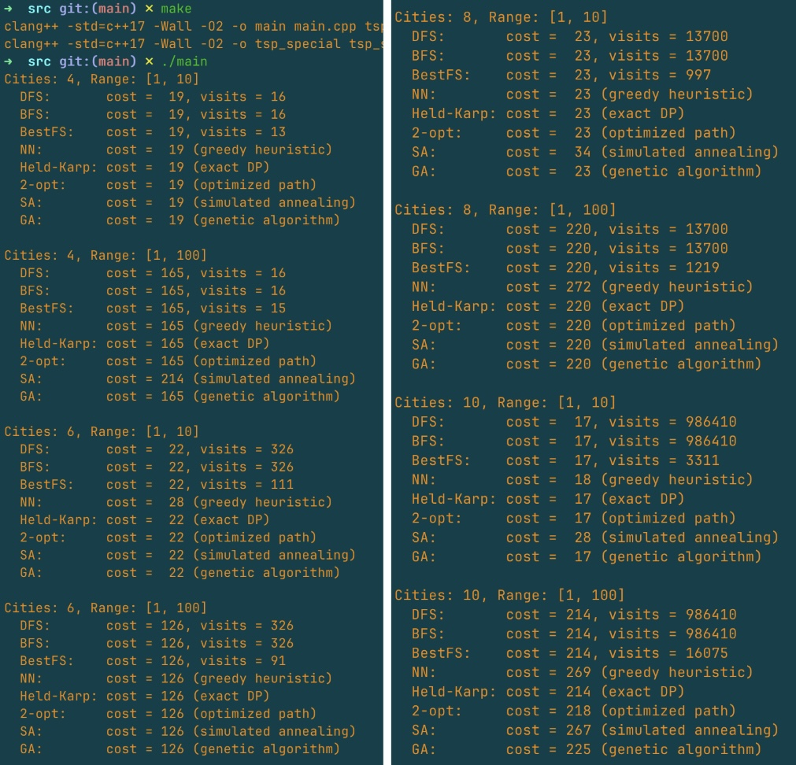
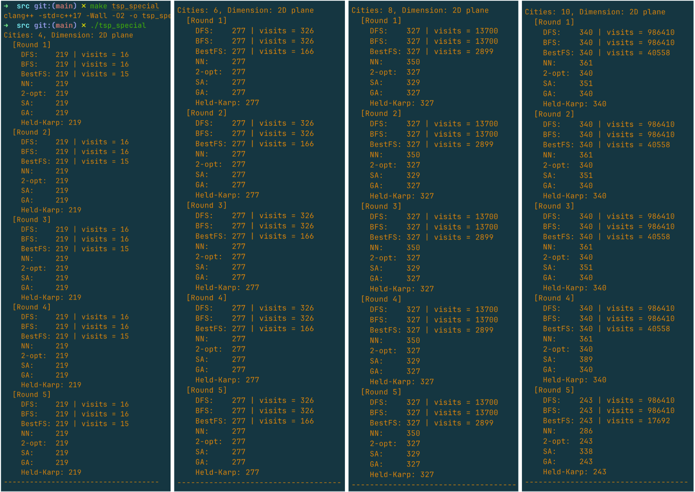

# 	HW3 Backtracking & Branch-and-Bound 

# 		Traveling Salesman Problem


## I. Introduction

The Traveling Salesman Problem (TSP) is a classic NP-hard problem in combinatorial optimization. Given a list of cities and the distances between each pair of them, the goal is to find the shortest possible route that visits each city exactly once and returns to the origin city.

Due to the factorial growth of possible routes, exact solutions become infeasible as the number of cities increases. As a result, researchers have developed various approaches to tackle TSP efficiently. These include exact algorithms (such as DFS, BFS, BestFS, and Held-Karp), greedy heuristics (like Nearest Neighbor), local optimization methods (e.g., 2-opt), and metaheuristic strategies (e.g., Simulated Annealing and Genetic Algorithms).

In this project, we implement and compare these approaches under different test conditions, including random cost matrices and special-case 2D geometric instances. We also experiment with improving the pruning efficiency of BestFS using better lower bounds, such as the Minimum Spanning Tree (MST).

---

## II. Algorithm Design

### 1. Depth-First Search (DFS)

A recursive backtracking algorithm that explores all possible city permutations. It keeps track of the best cost found. Although simple, it's only feasible for small n due to factorial time complexity.

```cpp
// Solves the TSP problem using depth-first search (DFS)
int TSP::solveDFS();
```


### 2. Breadth-First Search (BFS)

Uses a queue to explore all possible paths level by level. Like DFS, it guarantees the optimal path but is inefficient without pruning.

```cpp
// Solve TSP using BFS (Breadth-First Search)
int TSP::solveBFS();
```


### 3. Best-First Search (BestFS)

Improves BFS by prioritizing nodes with lower estimated cost using `cost + lower_bound`. Initially, the lower bound was estimated by the minimum outgoing edge from the current city.

```cpp
// Estimate a lower bound for remaining path from current city
int TSP::getLowerBound(const vector<bool> &visited, int city) const {
  int minEdge = INT_MAX;
  for (int i = 0; i < n; i++) {
    if (!visited[i] && dist[city][i] > 0) {
      minEdge = min(minEdge,
                    dist[city][i]); // Choose minimum cost to an unvisited city
    }
  }
  return (minEdge == INT_MAX ? 0 : minEdge); // Return 0 if no edge found
}
```

#### (Improved) MST-Based Lower Bound

To strengthen pruning, we implemented an improved lower bound using a Minimum Spanning Tree (MST) of the unvisited cities. The new bound is:

```cpp
// Estimate a lower bound for the TSP using Minimum Spanning Tree (MST)
// This function computes the MST cost over the unvisited cities using Prim's algorithm
int getMSTLowerBound(const vector<vector<int>>& dist, const vector<bool>& visited) {
  int n = dist.size();                    // Number of cities
  vector<bool> inMST(n, false);          // Track which nodes are already in the MST
  vector<int> minEdge(n, INT_MAX);       // Minimum edge weight to connect a node to the MST
  int total = 0;                          // Total cost of MST

  // Start MST from the first unvisited city
  for (int i = 0; i < n; ++i) {
    if (!visited[i]) {
      minEdge[i] = 0;
      break;
    }
  }

  // Build MST using Prim's algorithm
  for (int i = 0; i < n; ++i) {
    int u = -1;

    // Find the unvisited node with the smallest edge to the MST
    for (int v = 0; v < n; ++v)
      if (!visited[v] && !inMST[v] && (u == -1 || minEdge[v] < minEdge[u]))
        u = v;

    if (u == -1) break;                  // All reachable unvisited nodes are added
    inMST[u] = true;                     // Add node u to MST
    total += minEdge[u];                // Add its edge cost

    // Update minEdge for remaining unvisited nodes
    for (int v = 0; v < n; ++v)
      if (!visited[v] && !inMST[v] && dist[u][v] < minEdge[v])
        minEdge[v] = dist[u][v];
  }

  return total;                          // Return the MST cost (lower bound)
}
```

> To improve the quality of the lower bound used in BestFS, we implemented a function that computes the Minimum Spanning Tree (MST) over unvisited cities using Prim’s algorithm. The MST cost is then combined with the cheapest edge from the current city and back to the start, forming a tighter estimation of the remaining tour cost.


### 4. Nearest Neighbor Heuristic

A greedy method that always visits the closest unvisited city. Fast but often produces suboptimal routes.

```cpp
// Nearest Neighbor Heuristic (Greedy Approach)
// Starts from city 0 and repeatedly visits the nearest unvisited city.
int tspNearestNeighbor(const vector<vector<int>> &dist);
```


### 5. Held-Karp Algorithm

A dynamic programming approach with complexity $O(n^2 * 2^n)$. It uses bitmasking to store subproblem states and computes the shortest tour exactly.

```cpp
// Held-Karp Algorithm (Dynamic Programming Exact Solution)
// Time complexity: O(n^2 * 2^n)
// dp[mask][u] = minimum cost to reach subset `mask` ending at city `u`
int tspHeldKarp(const vector<vector<int>> &dist);
```


### 6. 2-opt Optimization

Starts from an initial path (usually NN) and repeatedly reverses segments to reduce total cost. Stops when no improvement is found. It's a local search that improves upon greedy solutions.

```cpp
// 2-opt optimization (starting from initial path)
int tsp2opt(vector<int> path, const vector<vector<int>> &dist);
```


### 7. Simulated Annealing

A probabilistic optimization that allows worse moves at high temperatures and gradually becomes greedier. Useful for escaping local minima.

```cpp
// Simulated Annealing
int tspSimulatedAnnealing(const vector<vector<int>> &dist, int maxIter = 10000);
```


### 8. Genetic Algorithm

Maintains a population of paths, selects parents, applies crossover and mutation, and evolves generations toward better solutions. Effective in large or rugged solution spaces.

```cpp
// Simplified Genetic Algorithm
int tspGenetic(const vector<vector<int>> &dist, int populationSize = 50, int generations = 300);
```

----

### ⏱ Time Complexity of TSP Algorithms

| Algorithm                          | Time Complexity    | Type               | Description                                                  |
| ---------------------------------- | ------------------ | ------------------ | ------------------------------------------------------------ |
| **DFS / BFS (Brute-force)**        | $O(n!)$            | Exact              | Explores all permutations of cities.                         |
| **BestFS (with pruning)**          | $O(n! / k)$(worst) | Exact + Pruning    | Still factorial in worst case, but significantly reduced by pruning using lower bounds. |
| **Held-Karp (DP)**                 | $O(n^2 · 2^n)$     | Exact              | Dynamic programming over subsets using bitmasking.           |
| **Nearest Neighbor (NN)**          | $O(n^2)$           | Greedy Heuristic   | At each step, selects the nearest unvisited city.            |
| **2-opt**                          | $O(k · n^2)$       | Local Optimization | Iteratively swaps pairs of edges to improve total cost; k = number of iterations. |
| **Simulated Annealing (SA)**       | $O(k · n)$         | Metaheuristic      | Iteratively perturbs the solution with probability-based acceptance. |
| **Genetic Algorithm (GA)**         | $O(g · p · n)$     | Metaheuristic      | g = generations, p = population size. Operates with selection, crossover, and mutation. |
| **MST (as lower bound in BestFS)** | $O(n^2)$ per node  | Subroutine         | MST is used as a lower bound heuristic in BestFS; requires MST computation at each node. |


---


## III. Program Structure

- `tsp_solver.h / .cpp` – contains class-based exact methods (DFS, BFS, BestFS)
- `tsp_fast_algorithms.h / .cpp` – includes Nearest Neighbor and Held-Karp
- `tsp_metaheuristics.h / .cpp` – implements 2-opt, Simulated Annealing, and Genetic Algorithm
- main.cpp / tsp_special_case_main.cpp  – Main programs to run experiments on random or geometric data and compare algorithm performance.

Key interface:

```cpp
int solveDFS();
int solveBFS();
int solveBestFS();
int tspNearestNeighbor(...);
int tspHeldKarp(...);
int tsp2opt(...);
int tspSimulatedAnnealing(...);
int tspGenetic(...);
```


---


## IV. Experimental Results

#### Test Setup Summary

We tested TSP instances with 4, 6, 8, and 10 cities. The distances between cities were generated randomly, with values ranging from either 1 to 10 or 1 to 100. Each instance was solved using eight different algorithms, and we recorded both the total cost of the route and, where applicable, the number of nodes visited during the search. 

Example result format:



- ### Experimental Observations

  In our experiments, we compared a wide range of TSP algorithms—exact, heuristic, and metaheuristic—across different input sizes and distance ranges. Below is a summary of our findings and key trends.

  #### Exact Methods

  **DFS** and **BFS** perform exhaustive search, visiting all `n!` permutations. They guarantee optimal results but quickly become intractable as `n` increases. At `n = 10`, both visited over 980,000 nodes.

  **BestFS** significantly improves over BFS by pruning unpromising branches using a lower bound heuristic. With the addition of an MST-based lower bound, BestFS was able to reduce visited nodes by over 10x in many cases, especially from `n = 8` onward. 

  **Held-Karp**, a dynamic programming solution using bitmasking, reliably produced optimal results for all tested cases up to `n = 10`, but becomes infeasible for `n > 20` due to exponential space requirements.

  #### Fast Heuristics

  **Nearest Neighbor (NN)** is simple and fast, selecting the closest unvisited city at each step. While efficient, it produced the least accurate results, especially under wider distance ranges like `[1, 100]` or when `n ≥ 8`.

  **2-opt** improves over NN by iteratively reversing edges to reduce path cost. Although it always improved the NN result, the final path heavily depended on the initial route, and optimality was not guaranteed.

  #### Metaheuristics

  **Simulated Annealing (SA)** accepts worse solutions early on to escape local optima, then gradually cools. SA often produced results within 1–5% of the optimum but was sensitive to parameter tuning and showed some inconsistency.

  **Genetic Algorithm (GA)** was the most reliable heuristic. Starting from a population of routes, it applied selection, crossover, and mutation to evolve better solutions. GA matched the optimal result in most cases and showed the lowest variance, making it a practical choice for larger instances.

  ---

  ### Node Visit Comparison

  | Cities | DFS Visits | BestFS Visits | Total Nodes (n!) | BestFS Visit Ratio |
  | ------ | ---------- | ------------- | ---------------- | ------------------ |
  | 4      | 16         | 15            | 24               | 0.6250             |
  | 6      | 326        | 166           | 720              | 0.2310             |
  | 8      | 13700      | 2899          | 40320            | 0.0720             |
  | 10     | 986410     | 40558         | 3628800          | 0.0112             |

  This table shows how pruning in BestFS drastically reduces the search space, especially as `n` increases. For `n = 10`, BestFS explored only ~1.1% of the total state space.

  ---

  ### Additional Observations

  - When the distance range expanded to `[1, 100]`, algorithms like NN performed significantly worse. Errors from greedy decisions became more costly.
  - GA and SA were more robust to distance variation and city layout.
  - MST-based lower bounds improved BestFS pruning, especially at larger `n`.

  | Algorithm           | Key Parameters                                               |
  | ------------------- | ------------------------------------------------------------ |
  | Simulated Annealing | Initial Temp = 1000, Alpha = 0.995, Iterations = 10,000      |
  | Genetic Algorithm   | Population = 50, Generations = 300, Crossover = 0.9, Mutation = 0.1 |
  
  ---
  
  ### Summary of Findings
  
  #### Observations:
  
  - **DFS / BFS**: Exhaustive and accurate but become infeasible beyond `n = 8`.
  - **BestFS**: Accurate with major improvements in node efficiency; pruning with MST is highly effective.
  - **Held-Karp**: Optimal results for all tested cases; grows exponentially in space.
  - **Nearest Neighbor**: Fastest, but least accurate, especially with wide distance ranges.
  - **2-opt**: Effective improvement over NN but sensitive to initial route.
  - **Simulated Annealing**: Moderate consistency; sometimes close to optimal.
  - **Genetic Algorithm**: Most stable among heuristics; often matches exact results.
  
  #### Quantitative Trends:
  
  - DFS/BFS node count grows as `n!`, making them impractical for large `n`.
  - BestFS benefits greatly from pruning, showing subfactorial growth.
  - Metaheuristics scale well and maintain reasonable accuracy for `n = 10`.
  - Larger distance ranges amplify heuristic error (NN/2-opt especially).

---


## V. **Special Case Result Analysis**

This section presents a detailed analysis of the experimental results for the Traveling Salesman Problem (TSP) under a special case: cities randomly distributed on a 2D plane. Each configuration was tested across five rounds with various algorithms.



### **Detailed Observations**

#### **Cities = 4**

All algorithms consistently produced the same optimal cost of 219 across all five rounds. This includes exact algorithms (DFS, BFS, BestFS, Held-Karp), greedy heuristics (Nearest Neighbor), local search (2-opt), and metaheuristics (SA, GA). The simplicity of the instance meant there was little room for error. Notably, BestFS visited slightly fewer nodes than DFS/BFS, demonstrating early pruning benefits even in small cases.

#### **Cities = 6**

With six cities, the result was again perfectly consistent across algorithms: cost 277 in every round. BestFS reduced node visits from 326 (DFS) to 166, showing clear pruning advantage. NN, SA, and GA all matched the exact solution, indicating that this instance remained easy to solve, even for heuristics.

#### **Cities = 8**

For eight cities, discrepancies began to emerge. DFS/BFS/BestFS/Held-Karp correctly found the optimal cost of 327. NN performed worse, returning a cost of 350 due to its greedy nature. However, 2-opt successfully corrected NN’s route back to optimal. SA yielded 329, only 0.6% above the optimum, showing high-quality performance. GA matched the optimal cost in all five runs. BestFS significantly reduced node visits to 2899 from 13700.

#### **Cities = 10**

At ten cities, problem complexity increased significantly. DFS and BFS required nearly one million node visits (986,410). BestFS reduced this to around 40,000. In Round 5, a different city layout caused the optimal cost to drop to 243, which all exact methods successfully found. NN consistently returned 361 (around +6% error), while 2-opt corrected it back to optimal. SA fluctuated from 351 to 389 (+14% in the worst case). GA remained perfectly consistent, hitting the optimal cost each time.

------

The following table summarizes the outcomes of all algorithms on 2D geometric cities (special case). Each configuration was tested five times, and the results were highly stable.

### Special Case Results Summary (2D Plane)

| Cities | Algorithm   | Cost    | Visits | Notes                          |
| ------ | ----------- | ------- | ------ | ------------------------------ |
| 4      | DFS/BFS     | 219     | 16     | Optimal                        |
|        | BestFS      | 219     | 15     | Slight pruning benefit         |
|        | NN / 2-opt  | 219     | –      | Identical to exact             |
|        | SA / GA     | 219     | –      | Identical to exact             |
| 6      | DFS/BFS     | 277     | 326    | Optimal                        |
|        | BestFS      | 277     | 166    | ~49% pruning                   |
|        | NN / 2-opt  | 277     | –      | Identical to exact             |
|        | SA / GA     | 277     | –      | Identical to exact             |
| 8      | DFS/BFS     | 327     | 13700  | Optimal                        |
|        | BestFS      | 327     | 2899   | ~78.8% pruning                 |
|        | NN          | 350     | –      | Error ~7%                      |
|        | 2-opt       | 327     | –      | Corrected to optimal           |
|        | SA          | 329     | –      | Slight deviation (~0.6%)       |
|        | GA          | 327     | –      | Always optimal                 |
| 10     | DFS/BFS     | 340     | 986410 | Optimal (except Round 5: 243)  |
|        | BestFS      | 340     | 40558  | ~95.9% pruning (Round 1~4)     |
|        | BestFS (R5) | 243     | 17692  | Matches special optimal layout |
|        | NN          | 361     | –      | Worst result (6% error)        |
|        | 2-opt       | 340     | –      | Fully corrected NN             |
|        | SA          | 351–389 | –      | Fluctuating, up to +14%        |
|        | GA          | 340/243 | –      | Matches exact every time       |

---

### **Summary of Observations**

#### **Key Insights:**

- **DFS / BFS**: Fully explores permutations. Becomes infeasible at n = 10 due to factorial growth (986,410 visits).
- **BestFS**: Same accuracy as DFS, but drastically fewer visits due to pruning (e.g., 17,692 vs 986,410).
- **Held-Karp**: Matches all exact solutions. Validates correctness up to n = 10.
- **Nearest Neighbor**: Performs well for small n but shows significant deviation starting at n = 8.
- **2-opt**: Reliably improves over NN and recovers optimal cost in every case.
- **Simulated Annealing**: Mostly close to optimal (within 1-3%), but can deviate up to +14%.
- **Genetic Algorithm**: The most stable heuristic. Matches the optimal cost in every round, all city sizes.

### **Quantitative Trends:**

- BestFS consistently reduces node visits by 4x to 50x over brute-force methods.
- SA shows good quality but higher variance.
- GA demonstrates both consistency and optimality, making it ideal for large instances.
- 2-opt is a good fast-fix for NN but depends on starting path quality.

> These results demonstrate that even in randomized 2D Euclidean scenarios, metaheuristics like GA perform nearly as well as exact algorithms but with far better scalability, especially when n > 8.

---


## VI. Conclusion

This project conducted a comprehensive comparison between exact and heuristic algorithms for solving the Traveling Salesman Problem under both generic and 2D geometric settings. 

We found that exact methods like DFS, BFS, and Held-Karp guaranteed optimality but suffered from scalability issues due to their factorial or exponential time complexity. BestFS, enhanced with MST-based lower bounds, showed a dramatic improvement in efficiency by pruning the state space, making it suitable for moderate input sizes (up to n = 10).

Among heuristic and metaheuristic algorithms, Genetic Algorithm (GA) proved to be the most consistent and reliable. It produced near-optimal or optimal solutions in all tested instances, especially in 2D cases. Simulated Annealing (SA) and 2-opt also provided good results with lower computational cost, though with slightly more variation.

Nearest Neighbor (NN), while fast, consistently produced suboptimal results in larger or more varied input scenarios. However, combining NN with 2-opt offered a lightweight improvement.

In conclusion, for small problem sizes, exact methods with pruning (BestFS + MST) are ideal. For larger instances where exact methods become impractical, GA stands out as a robust and efficient alternative. The use of multiple algorithm types offers valuable trade-offs between performance, quality, and computational cost.
