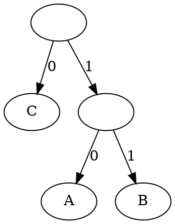

# Lab 05. Greedy 2

## Huffman coding

__Binary codes__ are the most common way that we represent data in modern information systems. 

We say a binary code is __prefix-free__ if no code is a prefix of any other codes. 

ASCII is a typical prefix-free code. Since every code  keeps the same length, an arbitrary character can not be substring of another character code. 

Morse code is not a prefix-free code. Assume that we represent a short signal with "0" and a long singal with "1". If we have a morse code message "000", we may decode it to "EEE", "EI", "IE", or "S". In this case, E(0) is a prefix of I(00) and S(000), and I is a prefix of S. 

Any prefix-free binary code can be represented as a binary tree with characters stored at the leaves. 
For example, if we have 3 characters A(10), B(11), C(0) in our alphabet, we can represent it as a binary tree as follows. 



Huffman code is a coding system that can optimize a prefix-code table which can optimized (let the coded information length as short as possible) a specific given string. 

We can generate a code-tree by following steps: 

1. Let each character be a single node tree and count their frequency. 
2. Choose 2 trees with the minimum frequencies and merge them. 
3. Repeat 2 until there are only one tree

And we can implement above algorithm as below in C++:

```C++
  class HuffmanCode {
      struct Node {
          Node *e0, *e1;
          int freq;
          char ch = -1;
      };

      Node *root;
      std::map<char, std::string> code;

      struct node_comp {
          bool operator () (const Node *a, const Node *b) { return a->freq > b->freq; } 
      };

      void travel(const Node *v, std::string prefix) {
          if (v->e0 == nullptr && v->e1 == nullptr)
              code[v->ch] = prefix;
          if (v->e0)
              travel(v->e0, prefix + "0");
          if (v->e1)
              travel(v->e1, prefix + "1");
      }

  public:
      HuffmanCode(std::string text) {
          std::map<char, int> ch_count;
          std::priority_queue<Node*, std::vector<Node*>, node_comp> trees;
          for (char ch: text) {
              if (ch_count.find(ch) == ch_count.end())
                  ch_count[ch] = 1;
              else
                  ch_count[ch]++;
          }
          // Step 1
          for (auto node: ch_count) {
              trees.push(new Node{nullptr, nullptr, node.second, node.first});
          }
          // Step 2 and 3
          while (true) {
              Node *t0 = trees.top();
              trees.pop();
              // if t1 is the only one tree
              if (trees.empty()) {
                  root = t0;
                  break;
              }
              Node *t1 = trees.top();
              trees.pop();
              trees.push(new Node{t0, t1, t0->freq + t1->freq, -1});
          }
          travel(root, "");
      }

      std::string operator [] (char ch) const {
          auto tar = code.find(ch);
          if (tar == code.end())
              throw "Not in alphabet";
          else
              return tar->second;
      }
  };
```

#### Question 1. The result of the Huffman tree algorithm is not unique. Please add some constraints to let the result unique. 


#### Question 2. std::map is Red-Black-Tree. std::priority_queue is heap. Assume length of `text` is $n$, which contains $m$ kinds of characters. What is the time complexity of `HuffmanCode(text)`?

## Scheduling problem

Consider a set of activities $A = \{a_1, a_2, \dots, a_n\}$, each with start time $s(a_i)$ and end time $e(a_i)$. People can not participate in two activities at the same time, in other words, people can choose activities without overlapping in time. The problem asks you to maximize the number of activities that a person can attend.

We can add some constraints to above problem like: maximize the number of activities that a person can attend within __a specific time range__. If we use $[0, \inf)$ as our time range, then the modified problem should equivalent to original problem. we can denote the maximum number activities we can choose from $A$ in time range $[s, t)$ by $f(A, s, t)$.

Assume that there are 2 time ranges $[s_0, t_0)$ and $[s_1, t_1)$ that $s_0 \le s_1 < t_1 \le t_0$. It is trivial that $f(A, s_0, t_0) \ge f(A, s_1, t_1)$. Consider maximizing the left time range that we can use, it is always best to choose the first-end activities. Thus, we may design an algorithm to solve the problem as followed: 

1. Sort $A$ order by $e(a_i)$ in increasing order. 
2. Scan activity sequentially.
2.1 choose first unvisited activity.
2.2 ignore all activities that overlap with the last chosen activity.

and may implement as followed: 

```C++
struct Activity {
    int s, e;
};

bool a_comp(const Activity &a, const Activity &b) {
    return (a.e < b.e);
}

int max_schedule(std::vector<Activity> A) {
    std::sort(A.begin(), A.end(), a_comp);
    int count = 1;
    int end = A[0].e;
    for (int i = 1; i < A.size(); ++i) {
        if (end > A[i].s)
            continue;
        end = A[i].e;
        ++count;
    }
    return count;
}
```

#### Question 3. Please modify above algorithm to choose the minimum number of activities to cover the whole time range. 

#### Question 4. Activities with overlapping in time cannot be in the same room. Please design an algorithm to find how many rooms we need to hold all the given activities. 
> Hint: Sort $s(A) \cup e(A)$ rather than sort $A$

## Fractional knapsack problem 

Knapsack problem is a classical optimization problem that defined as follows:
> Instance: list of items $X = \{ x_1, x_2, \dots, x_n \}$, each item has value $v(x_i)$ and weight $w(x_i)$. A capacity $Cap$.
> 
> Result: A collection $A = \{ a_1, a_2, \dots, a_n \}$ that satisifies $\sum_{i = 1}^n a_i w(x_i) \le Cap$ and maximize $\sum_{i = 1}^n a_i v(x_i)$.

If $a_i \in \{ 0, 1 \}$ for any $1 \le i \le n$, we name the problem a "0/1 knapsack problem". 
If $a_i \in \{\mathbb{R} | 0 \le a_i \le 1 \}$ for any $1 \le i \le n$, we name the problem a "fractional knapsack problem". 

To solve knapsack problem, cost-performance (capability / price) ratio may be a good heuristic. 
$Cap$ is the resource, $v(x_i)$ is performance, and $w(x_i)$ is the cost. 

We may apply the heuristic as follows: 

```C++
struct Item {
    int v, w;
};

bool cp_comp(const Item &a, const Item &b) {
    return (static_cast<double>(a.v) / a.w) > (static_cast<double>(b.v) / b.w);
}

#include <algorithm>

std::vector<double> knapsack(std::vector<Item> &X, int Cap) {
    std::sort(X.begin(), X.end(), cp_comp);
    std::vector<double> A(X.size(), 0);
    for (int i = 0; i < X.size(); ++i) {
        if (Cap >= X[i].w) {
            A[i] = 1;
            Cap -= X[i].w;
        }
        // 0/1 knapsack should omit else branch
        else {
            A[i] = static_cast<double>(Cap) / X[i].w;
            Cap = 0;
        }
    }
    return A;
}

double total_value(const std::vector<Item> &X, const std::vector<double> &A) {
    double sum = 0;
    for (int i = 0; i < X.size(); ++i)
        sum += A[i] * X[i].v;
    return sum;
}
```

#### Question 5. We know that the greedy approach cannot always guarantee the optimal answer. Please discuss when we have multiple items with the same value/weight ratio, should we prioritize items with smaller weights or larger weights?